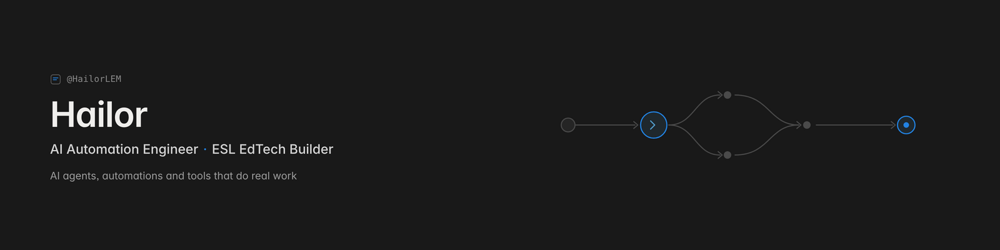

  

<h1 align="center">Fedor Molodtsov · AI Automation Engineer</h1>

  I build AI automations that ship — agent pipelines, integrations and tools that replace hours of manual work.

Everything in this account runs in production for a private ESL teaching practice
(thousands of lessons delivered): lesson generators, a voice-note → Notion student
tracker, AI-scored Minecraft plugins, interactive web demos.

**Currently building:** a video → lesson-guide pipeline (Deepgram transcription → normalizer → teacher's-guide generator) and an Edvibe lesson-building agent.

**Open to:** contract AI-automation work and remote roles (UTC+7).

  
  
  
  
  

## Selected projects

| Project | What it does | Proof | Stack |
|---|---|---|---|
| [**ESL Automation Suite**](https://github.com/itsfedor/esl-automation-suite) | AI teaching pipelines: lesson-guide generator, voice → Notion student tracker, video-review summaries (Deepgram), TV-episode homework, Edvibe lesson builder | 6 pipelines · 3 installable agent skills | Python · LLM APIs · Notion · Deepgram |
| **ESL Minecraft plugins** — [chat2earn](https://github.com/itsfedor/chat2earn) · [englishprogression](https://github.com/itsfedor/englishprogression) · [vocabquiz](https://github.com/itsfedor/vocabquiz) · [dailyenglish](https://github.com/itsfedor/dailyenglish) | 4 PaperMC plugins that turn a Minecraft server into an English classroom: AI-scored chat payouts, earnings-driven level-ups, vocab quizzes, daily tasks | 4 plugins · ~2,500 lines of Java · Vault + LuckPerms | Java · PaperMC · Groq |
| [**ChainLuck**](https://github.com/itsfedor/demo-casino) | Provably-fair demo crypto casino — Dice, Plinko, Blackjack, Slots, Crash, Mines. Play money only | 6 games · machine-verified RTP (`rtp-check.mjs`) · [live demo](https://itsfedor.github.io/demo-casino) | Vanilla JS · GitHub Pages |
| [**Worklog**](https://github.com/itsfedor/worklog) | Daily log of what actually shipped, written by a scheduled agent | machine-readable · one entry per workday | Automation |

## Recent activity

<!-- WORKLOG:START -->
- **2026-09-15**: Portfolio overhaul + rebrand to Fedor Molodtsov / itsfedor: full secret + PII audit of every public repo, Gradle wrappers and build files restored for the Minecraft plugins, every plugin README upgraded, all social previews refreshed.
- **2026-09-15**: Published [cli-anything-edvibe](https://github.com/itsfedor/cli-anything-edvibe) — a reverse-engineered WebSocket-RPC CLI that builds Edvibe lessons and homework from specs (17 exercise types, 20 tests); a 27-block B2 lesson and three course units were built through it.
- **2026-08-29**: Video pipeline end-to-end: Deepgram EN+RU transcription, a 16-minute homework-review edit with bilingual captions, and a student-facing HTML summary.
- **2026-08-27**: Clean-B1 TED-Ed "Prohibition" guide with differentiated tasks, plus a clothes-quality homework pair staged Past Simple vs Present Perfect.
<!-- WORKLOG:END -->

_Appended by a scheduled agent when there's real work to log. Full history: [worklog](https://github.com/itsfedor/worklog)._

## Get in touch

- GitHub: [@itsfedor](https://github.com/itsfedor)
- Telegram: [@itsfedor](https://t.me/itsfedor)
- Open to AI-automation and EdTech collaborations. Pick a repo, check the README, and let's talk.
