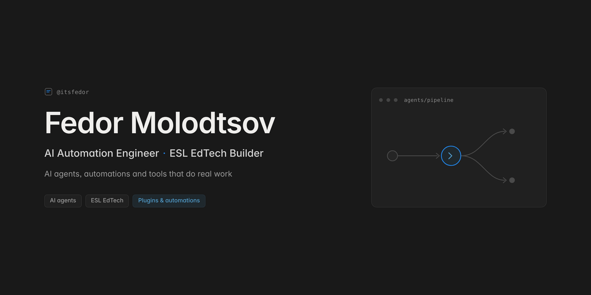

  

<h1 align="center">Hailor | AI Automation Engineer & ESL EdTech Builder</h1>

  I design and ship AI-powered tools that do real work: teaching pipelines,
  interactive web demos, custom game-server plugins, and AI-integration
  decks for business.

  
  
  
  
  
  

## What I do

- **AI automations for real workflows**: voice notes that land straight in a
  Notion student tracker, lesson content generated from raw videos, custom
  Minecraft plugins that score English chat.
- **ESL EdTech pipelines**: lesson-guide generators, personalized exercise
  builders, gamified English servers. Built for a private teaching practice
  with thousands of lessons delivered.
- **Interactive web experiences**: scroll-driven decks, video showreels,
  game-style demos, all deployed to GitHub Pages with CI.

## 📦 Featured projects

| Project | What it is | Links |
|---|---|---|
| 🎓 **ESL Automation Suite** | AI teaching pipelines: lesson-guide generator, voice → Notion student tracker, TV-episode homework, C1 exercise builder | [repo](https://github.com/HailorLEM/esl-automation-suite) |
| 🎮 **Minecraft English Server** | Gamified ESL server: chat color = English level A0→D1, AI-scored chat money, quests, 4 custom plugins with source | [repo](https://github.com/HailorLEM/minecraft-english-server) · [live](https://hailorlem.github.io/minecraft-english-server) |
| ⚡ **ChainLuck** | Provably-fair demo crypto casino: Dice, Plinko, Blackjack, Slots. Play money only | [repo](https://github.com/HailorLEM/demo-casino) · [live](https://hailorlem.github.io/demo-casino) |
| 🏛️ **ИИ × АРХИТЕКТУРА** | Scroll-driven deck: how AI actually enters an architecture/design firm's workflow | [repo](https://github.com/HailorLEM/presentation) · [live](https://hailorlem.github.io/presentation) |
| 🎬 **AI Experience** | Cinematic video-scroll showreel on adopting AI in a company | [repo](https://github.com/HailorLEM/presentation-video) · [live](https://hailorlem.github.io/presentation-video) |
| 📊 **C1 Visual Data Writing** | Personalized C1 academic-writing exercise for an ESL student | [repo](https://github.com/HailorLEM/taimas-visual-data) · [live](https://hailorlem.github.io/taimas-visual-data) |

## ⚡ Recent activity

<!-- WORKLOG:START -->
_No entries yet._
<!-- WORKLOG:END -->

_Appended automatically each evening. See [worklog](https://github.com/HailorLEM/worklog)._

## 📫 Get in touch

- GitHub: [@HailorLEM](https://github.com/HailorLEM)
- Open to AI-automation and EdTech collaborations. Check the repos, pick a pattern, and let's talk.
